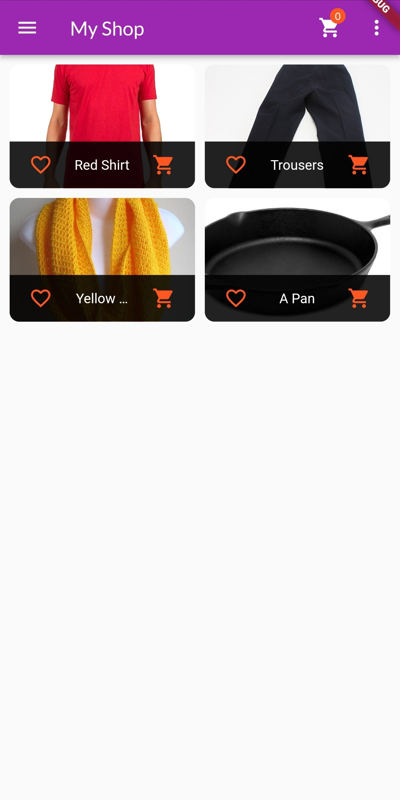
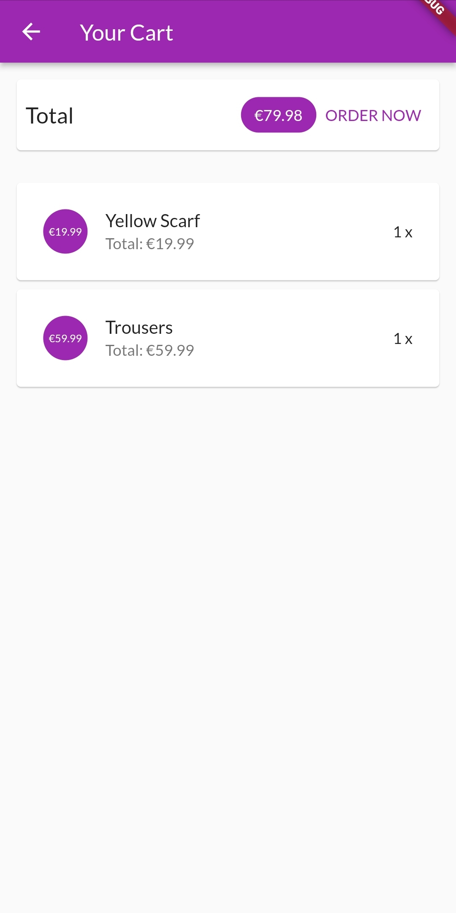

# 🛒 Shop App

  
  

An application in which you can shop, see which products you have in your cart and place an order. A demo application made in flutter from this Udemy course.

- Flutter version: 3.3.x
- Dart version: 2.18.x

## Packages

The following packages are used in this project:

- [provider](https://pub.dev/packages/provider)
- [intl](https://pub.dev/packages/intl)

## Getting Started

This project is a starting point for a Flutter application.

A few resources to get you started if this is your first Flutter project:

- [Lab: Write your first Flutter app](https://docs.flutter.dev/get-started/codelab)
- [Cookbook: Useful Flutter samples](https://docs.flutter.dev/cookbook)

For help getting started with Flutter development, view the
[online documentation](https://docs.flutter.dev/), which offers tutorials,
samples, guidance on mobile development, and a full API reference.
